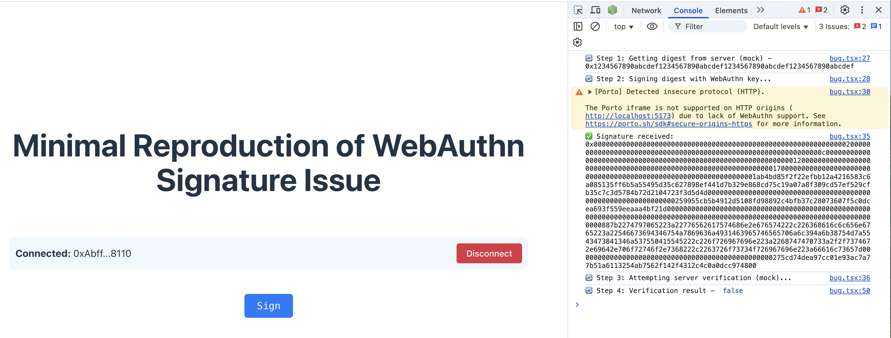

# Step to reproduce the issue

1. Run `pnpm install`
2. Run `pnpm dev`
3. Connect to the wallet
4. Click on the "Sign" button
5. See the console output

## Actual behavior

# Expected behavior

The signature should be verified successfully.

