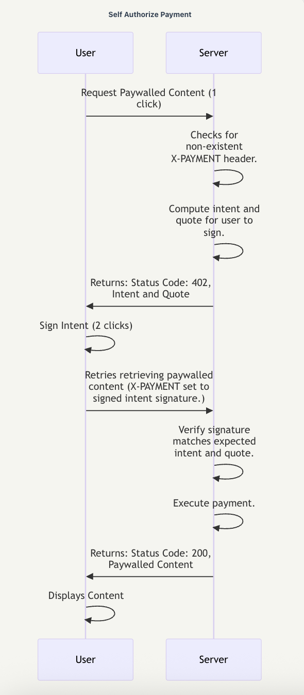
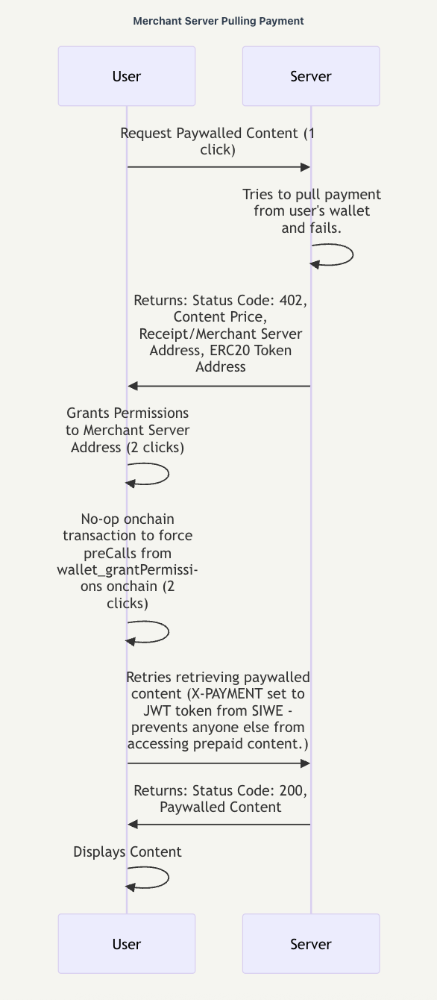

# Porto Payment Integration Demo

A full-stack application demonstrating two payment patterns using the Porto protocol for accessing paywalled content.

## Project Structure

```
├── src/                    # React frontend
│   ├── App.tsx            # Main application
│   ├── PurchaseButtonSelf.tsx      # Self-payment component
│   └── PurchaseButtonDelegate.tsx  # Delegated payment component
└── server/                # Hono backend
    ├── src/index.ts       # Payment server
    └── images/            # Flow diagrams
```

## Payment Patterns

### Self-Payment
Users sign their own payment transactions directly. The server prepares the transaction, user signs it, and the server executes it.



### Delegated Payment  
Users grant permissions to the merchant server, which then executes payments on their behalf. Requires upfront permission granting.



## Technology Stack

- **Frontend**: React, wagmi, Porto wallet integration
- **Backend**: Hono, Cloudflare Workers
- **Authentication**: Sign-In With Ethereum (SIWE)
- **Payment Protocol**: Porto + X402 standard

## Prerequisites

- Node.js 18+
- pnpm
- Funded Porto wallet

## Quick Start

1. **Install dependencies:**
   ```bash
   pnpm install
   ```

2. **Start the server:**
   ```bash
   cd server
   pnpm dev
   ```

3. **Start the frontend:**
   ```bash
   pnpm dev
   ```

4. **Connect Porto wallet** and ensure you have Base Sepolia testnet tokens

## Environment Setup

### Server (.env)
```bash
MERCHANT_ADDRESS=0x...
MERCHANT_PRIVATE_KEY=0x...
JWT_SECRET=your-secret-here
```

### Frontend 
Update `SERVER_URL` in constants to point to your deployed server.

## Deployment

- **Frontend**: Deploy to Vercel
- **Server**: Deploy to Cloudflare Workers (see [server README](server/README.md))

## Disclaimer

This is a demo project and should not be used in production.
