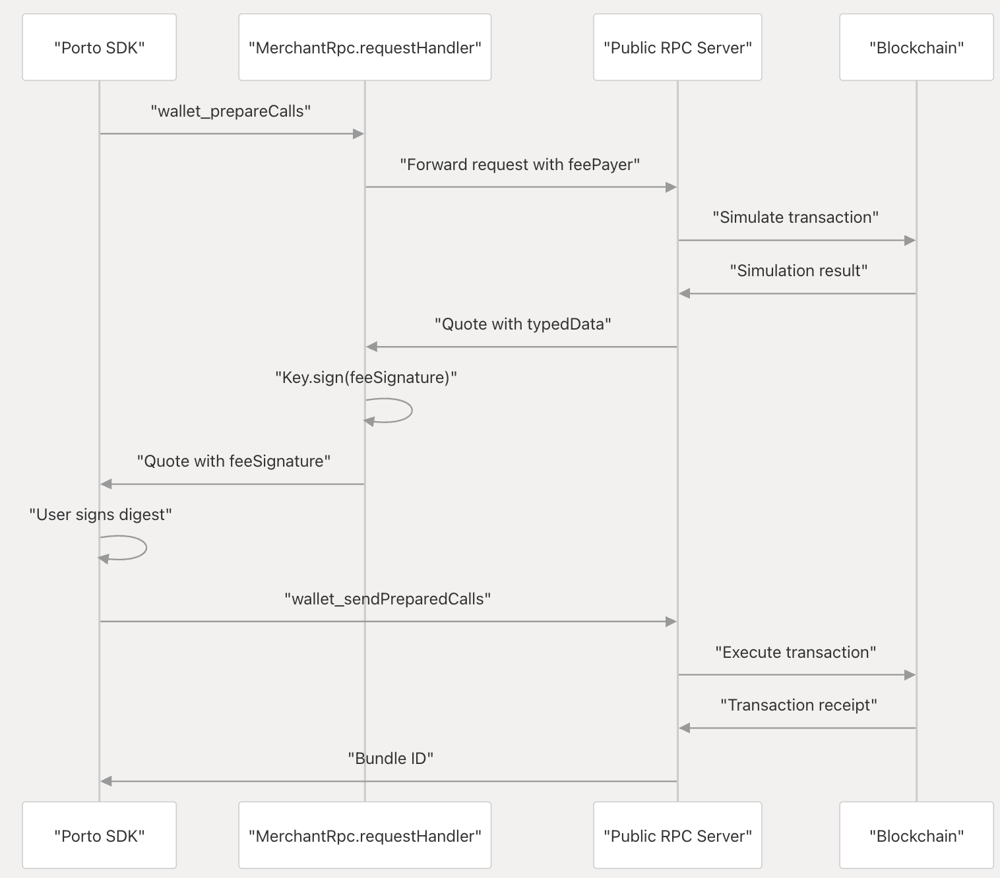

```txt
pnpm install
pnpm run dev
```

```txt
pnpm run deploy
```

### Notes

My merchant account: [0x1e2685b3ac09a4ef4e732a9b84d69eaf4d2f6de1](https://sepolia.basescan.org/address/0x1e2685b3ac09a4ef4e732a9b84d69eaf4d2f6de1)

Run `pnpx porto onboard -a` to create a merchant account. I got stuck on this part for way longer than I should have. I finally read this [guide](https://porto.sh/sdk/guides/sponsoring) and it worked. I took the address and private key generated from that command and put them in the `.dev.vars` file.

User sends a request from the Porto SDK in the browser to `wallet_prepareCalls`. This gets routed to the merchantRpcUrl first. The merchantRpcUrl decides if it wants to sponsor the request. If it does, it will forward the request to Porto's public RPC server to get a fee quote. After receiving the response from Porto's RPC server, the merchant server signs the fee payment using its private key and includes this signature in the response as feeSignature.

The merchant server only handles wallet_prepareCalls requests.



The command `pnpx porto onboard -a` creates a new Porto account with an additional admin key for server access.

### More Notes

Making key hash from address:
```bash
# 2 is the type of the key, in this case secp256k1.
➜ keccak256(abi.encode(2, keccak256(abi.encode(0x23016fdcc2443ee4576c59809266545b36b52d39))))
Type: bytes32
└ Data: 0xd85d391c3f57a9ede51f682cb1e9795555f6b1bdc6f30ed06828126f021d5983
```

```bash
# This address was given to us from running `pnpx porto onboard -a`. It's not actually the address that gets calculated from the merchants private key.
➜ keccak256(abi.encode(2, keccak256(abi.encode(0x64574add22aa10ffff44f096a388bf1718896b8b))))
Type: bytes32
└ Data: 0xc6faf5c5298cd0a4e450c568592a7701c5c1c0c9ee74ef8c68b159ca0dc37529
```

## KV Namespace

Add a new KV namespace:
```bash
# Example:
npx wrangler kv namespace create "NONCE_STORE" --preview
```